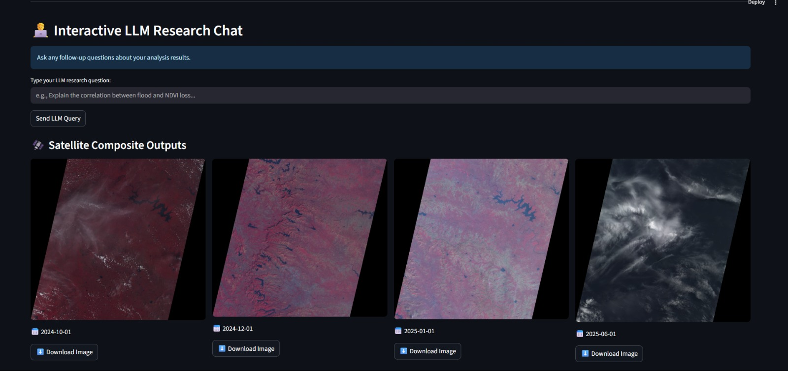
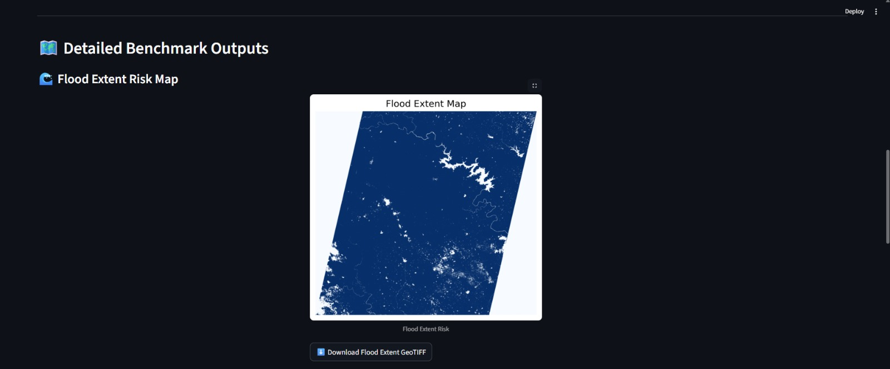
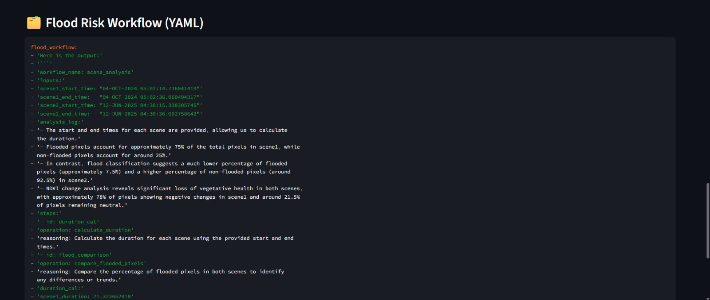

# 🌍 Geospatial Information System Project
This project demonstrates the processing and visualization of geospatial raster data to detect Flood Extent and NDVI (Normalized Difference Vegetation Index) Change Detection using Python, rasterio, numpy, and matplotlib. It also integrates Large Language Models (LLMs) like Llama3:8b for automated analysis, insights generation, and explains how a Streamlit UI can enhance user interaction.
# 🌍 Geospatial Information System Project

## 📑 Table of Contents
- [Project Structure](#-project-structure)
- [Core Formulas Used](#️-core-formulas-used)
- [Why Llama3:8b](#-why-llama38b-llm-for-gis-and-image-detection)
- [Streamlit UI](#-streamlit-ui)
- [Sample Outputs](#-sample-outputs)
- [Potential Bottlenecks & Usage Notes](#-potential-bottlenecks--usage-notes)
- [Get Started](#-get-started)
- [Data Source](#-data-source)

## 📂 Project Structure
Flood Extent Mapping:
Detects flooded areas by calculating the change in NDWI (Normalized Difference Water Index) between two time periods.

Uses a threshold to classify flooded vs non-flooded pixels.

Outputs GeoTIFF, PNG map, and summary charts.

NDVI Change Detection:
Monitors vegetation health changes over time by comparing NDVI rasters.

Highlights gain, loss, or neutral vegetation zones.

Outputs GeoTIFF, PNG visualizations, and bar charts of pixel counts.

Data Source:
All satellite data used in this project is sourced from NRSC Bhoonidhi.

## ⚙️ Core Formulas Used
### ✅ NDWI Change for Flood Extent
```
Delta NDWI = NDWI_2025 - NDWI_2024
Flood Mask = 1 if Delta NDWI > 0.2 else 0
```
### ✅ NDVI Change Detection
```
Delta NDVI = NDVI_2025 - NDVI_2024
Categories:
   - Gain: Delta NDVI > 0.1
   - Loss: Delta NDVI < -0.1
   - Neutral: -0.1 ≤ Delta NDVI ≤ 0.1
```

## 🤖 Why Llama3:8b (LLM) for GIS and Image Detection?
### ✅ Automates generation of analytical summaries and natural language explanations.

### ✅ Helps generate domain-specific insights for complex geospatial outputs.

### ✅ Assists in error detection, parameter tuning, and threshold validation.
### llama instiallation <a href="https://ollama.com/library/llama3:8b">go to</a>


### 🖼️ Streamlit UI
This project can be wrapped with a Streamlit front-end to:

Upload raster datasets (NDWI, NDVI).

Run the processing pipeline with one click.

Visualize flood extent maps and NDVI change heatmaps.

Display summary charts and Llama3:8b generated explanations interactively.

## 🗂️ Sample Outputs
### Usage



### 📌 Flood Extent


### 📌 YAML workflow


### 🖼️ Images and Maps (summary charts)


## Potential Bottlenecks & Usage Notes
✅ Single Click Only: Click the Submit button in the Streamlit UI only once — multiple clicks may generate duplicate outputs.

✅ Processing Time: Please wait while the processing completes. The speed depends on your RAM, graphics card, and internet connection, as images are scraped from the web and large downloads may take time.

✅ Configuration: Always make changes in the config file before running the app. Ensure all file paths are correct.

✅ LLM Dependency: Make sure Llama3:8b is installed and running on your system before starting the analysis.

✅ One Search at a Time: Only one search/processing task is available per location and time. Downloaded data will be saved to your Downloads folder.

✅ Clean Downloads Folder: Make sure your Downloads folder is clear of any old ZIP files for today’s date — delete any unnecessary or duplicate ZIP files before running a new download.

✅ Custom Data Sources: If you want to change the satellite or data source, modify webscrap.py. This project currently uses Resourcesat satellite images.

## 🚀 Get Started

### Clone the repo.
```
git clone https://github.com/Nemaleshh/GIS-ASSIST.git

cd GIS-ASSIST
```

### Install dependencies:
```
pip install -r requirements.txt

```

### ℹ️Note : read bottlenecks before runing this repo

### Run the application
```
streamlit run app.py
```

## 🔗 Data Source
Data provided by NRSC <a href="https://bhoonidhi.nrsc.gov.in/bhoonidhi/home.html">Bhoonidhi</a>.

Satelite image : RESOURCESAT2A

🔔if any error occur go and check the terminal make use of this application for comple geospatial analysis
